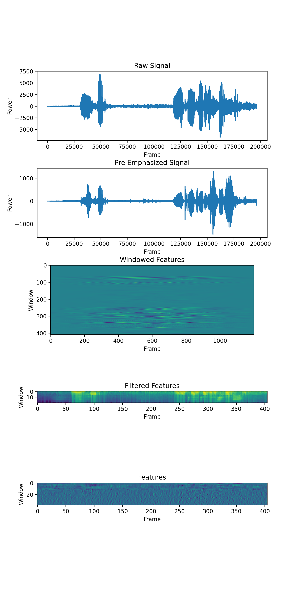

# Lab1 Documentation

> Course: 2021 Speech Recognition Lab1, School of Software Engineering, Tongji Univ.
>
> Speech Signal Processing
>
> Name：沈益立 Yili Shen
>
> Student ID: 1851009


# 1. Introduction

This project is meant to use caconical DSP(digital signal processing) approaches to extract features from a vocal signal series, mainly using mel-filter bank and several DFTs.

# 2. Architecture

## 2.1 Feature Extraction


The process of this type of feature extraction can be indicated as the image. To be specific, the process can be seperated as

1. Read the raw data.
2. Using pre-emphasis techniques, to give high-freq signals more weights. (High-freq signals usually have more information.)
3. Framing and windowing, to give frames and re-distributing them, to make it as continuous as possible.
4. DFT, extract the meaningful features.
5. Using Mel-filterbank, to simulate what human ear hears like, and apply log func to each of the feature
6. Using DCT, to further extract features.
7. Using one-stage and two-stage differences, to expand the feature dims.
8. Transforming features to the normal form.

# 3. Results




# 4. Codes

## 4.1 Reading Raw data

```python
def read_wav(path: str) -> [np.ndarray, int]:
    r"""
    Reading the wav file, using scipy lib func.
    :param path: The path of wave file to be read.
    :return: signal - the intensity of wave, sample rate - the rate of sampling
    """
    sample_rate, signal = scipy.io.wavfile.read(path)
    return signal, sample_rate
```


## 4.2 Pre-emphasizing

```python
def pre_emphasis(signal: np.ndarray, alpha: float = 0.97):
    r"""
    Eliminate the bias between high freq and low freq.
    :param signal: raw signal produced in the previous step
    :param alpha: a parameter to determine how much the previous signal is subtracted
    :return: pre-emphasized signal
    """
    res = signal[1:] - alpha * signal[:-1]  # y(t) = x(t) - a * x(t - 1)
    return res
```


## 4.3 Framing

```python
def framing(signal: np.ndarray, sample_rate: int, frame_time: float = 0.025, stride: float = 0.010):
    r"""
    Creating several frames, to embed the pre-emphasized signal into frames.
    :param signal: previously-proceeded signal, a series.
    :param sample_rate: sample rate
    :param frame_time: the length of each frame
    :param stride: the step between frames
    :return: framed signal, whose shape is (frame_time * sample_rate, ceiling(signal / int(frame_stride * sample_rate)))
    """
    frame_len = int(frame_time * sample_rate)
    stride_len = int(stride * sample_rate)
    first_pos = 0
    framed_result = []
    while first_pos + frame_len < len(signal):
        framed_result.append(signal[first_pos: first_pos + frame_len])
        first_pos += stride_len
    last_frame = np.append(signal[first_pos:], np.zeros((frame_len - (len(signal) - first_pos))))
    framed_result.append(last_frame)
    framed_result = np.array(framed_result)
    return framed_result
```


## 4.4 Windowing

```python
def window(ori_frame: np.ndarray, N: int, alpha: float = 0.46164) -> np.ndarray:
    r"""
    Transforming the framed ones to continuous ones. Here we are using Hamming-like approaches.
    :param alpha: Windowing coefficient, where Hanning window is 0.5, Hamming window is 0.46164. Default: hamming.
    :param N: The length of Windowing.
    :param ori_frame: Original frame, which has been embedded previously.
    :return: Windowed(using certain weight redistributed) frames, whose shape is identical to the original ones.
    """
    n = np.arange(0, N)
    hamming = (1 - alpha) - alpha * np.cos(2 * np.pi * n / (N - 1))
    ori_frame *= hamming
    return ori_frame
```


## 4.5 Mel Filter Bank

```python
def mel_filter_bank(low_freq: int, high_freq: int, nfilter: int, nfft: int, sample_rate: int) -> np.ndarray:
    r"""
    To non-linearize freq so that it shows more alike to human ear.
    Then creating some filters to extract triangle signals. (A kind of naive feature extraction)
    :param low_freq: The floor of freq, which is canonically zero.
    :param high_freq: The ceiling of freq, which is canonically a half of sample rate.
    :param nfilter: The number of filter, which ranges canonically from 26 to 40.
    :param nfft: The number of fft we previously used.
    :param sample_rate: The sample rate of the signal
    :return: A matrix containing filter banks.
    """
    low_freq_mel = 2595 * (np.log10(low_freq / 700 + 1))
    high_freq_mel = 2595 * (np.log10(high_freq / 700 + 1))
    arr_freq_mel = np.linspace(low_freq_mel, high_freq_mel, nfilter + 2)
    arr_freq = 700 * (10 ** (arr_freq_mel / 2595) - 1)
    f = np.floor((nfft + 1) * arr_freq / sample_rate)
    f_bank = np.zeros((nfilter, int(nfft / 2) + 1))
    for m in range(1, nfilter + 1):
        left_point = f[m - 1]
        mid_point = f[m]
        right_point = f[m + 1]
        for k in range(int(left_point), int(mid_point)):  # filling the left part
            f_bank[m - 1, k] = (k - f[m - 1]) / (f[m] - f[m - 1])
        for k in range(int(mid_point), int(right_point)):
            f_bank[m - 1, k] = (f[m + 1] - k) / (f[m + 1] - f[m])

    return f_bank
```


## 4.6 Dynamic Featurize

```python
def dynamic_featurization(mfccs: np.ndarray, windowed: np.ndarray) -> np.ndarray:
    r'''
    Do dynamic featurizations, use dct conclusions to combine original features and original total energies,
    and one-stage difference and two-stage difference.
    Suppose that the original feature is 12-dim, so that the total original feature contains 12 + 1(energy) dim.
    And with one, two-stage difference, the total features is 39.
    :param mfccs: The features which was produced by dct.
    :param windowed: Previously windowed signals.
    :return: Features
    '''
    energy = windowed.sum(1)  # type: np.ndarray
    energy = energy.reshape((len(energy), 1))
    # print(mfccs.shape)
    features = np.concatenate([mfccs, energy], 1)

    delta_mfccs = np.concatenate([[mfccs[0]], (mfccs[2:] - mfccs[:-2]) / 2, [mfccs[-1]]])
    delta_energy = np.concatenate([[energy[0]], (energy[2:] - energy[:-2]) / 2, [energy[-1]]])
    features = np.concatenate([features, delta_mfccs, delta_energy], 1)

    delta_delta_mfccs = np.concatenate([[delta_mfccs[0]], (delta_mfccs[2:] - delta_mfccs[:-2]) / 2, [delta_mfccs[-1]]])
    delta_delta_energy = np.concatenate(
        [[delta_energy[0]], (delta_energy[2:] - delta_energy[:-2]) / 2, [delta_energy[-1]]])
    features = np.concatenate([features, delta_delta_mfccs, delta_delta_energy], 1)

    return features
```


## 4.7 Feature Normalization

```python
def feature_transform(features: np.ndarray):
    r"""
    Use normalizations, to make the features submit to normal distribution.
    :param features: Features proceeded
    :return: Normalized features.
    """
    mean = features.mean(0)
    std = features.std(0)
    features = (features - mean) / std
    return features
```


# 5. Conclusion and Reflection

- This experiment is basically modified on the given slides and reference blogs, when I'm trying to implement them on my own, I got confused on 
  - Q: What does mel-filter really mean and its principle behind?
  - A:  It simulates human beings' cochlea, and lets spectrogram model the freq reslolution analogue to humans' frequency resolution. And it changes the frequency axises, to make low dif between low freq and high dif between high freq the same magnitude. Moreover, it lowers the dimension.
  - Q: What is dynamic features for?
  - A: Actually it's simply the addition of energies and concats 1 and 2-stage differences.
- With regard to personal perspective, I felt that I'm lack of conventional DSP knowledges, which is crucial in this project. Besides, I really want to implement several deep learning approaches based on time-series / sequential methods in the following labs. I believe using end-to-end supervised learning will show great advances.


# 6. How to run my code?

Firstly you should run the command in the terminal, to install requirement libs. Then simply run the code.

```shell
pip3 install -r requirements.txt
python3 main.py
```

